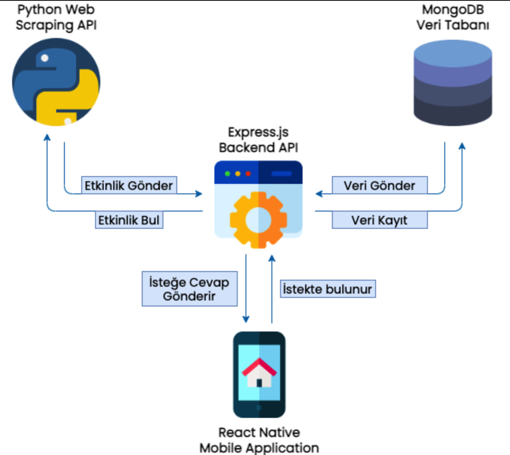
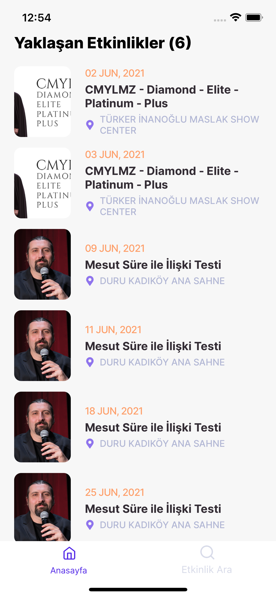
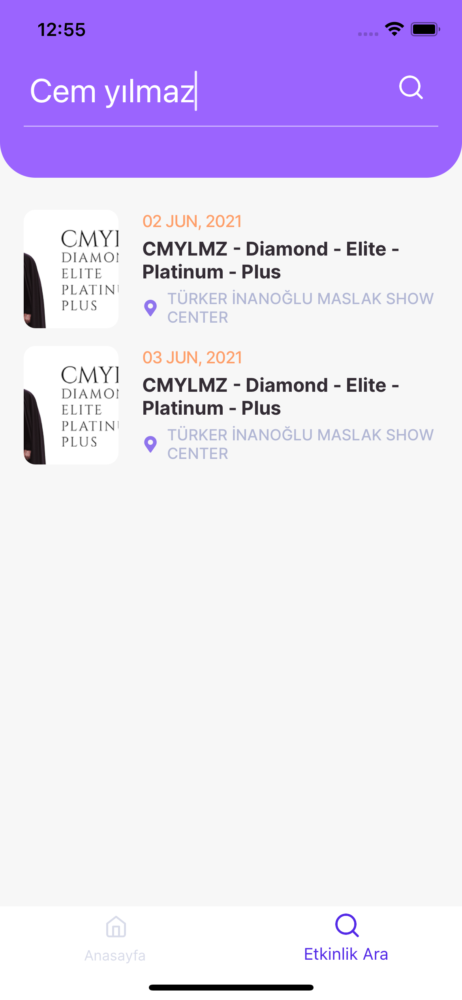
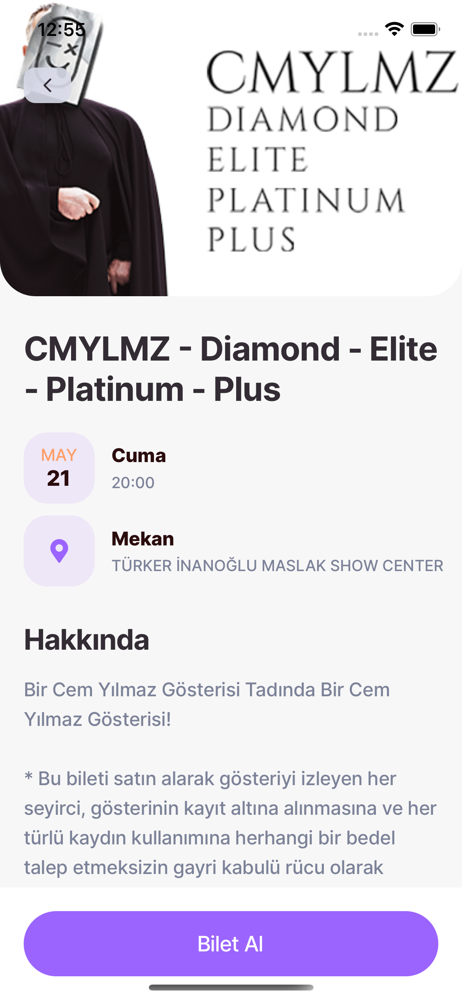
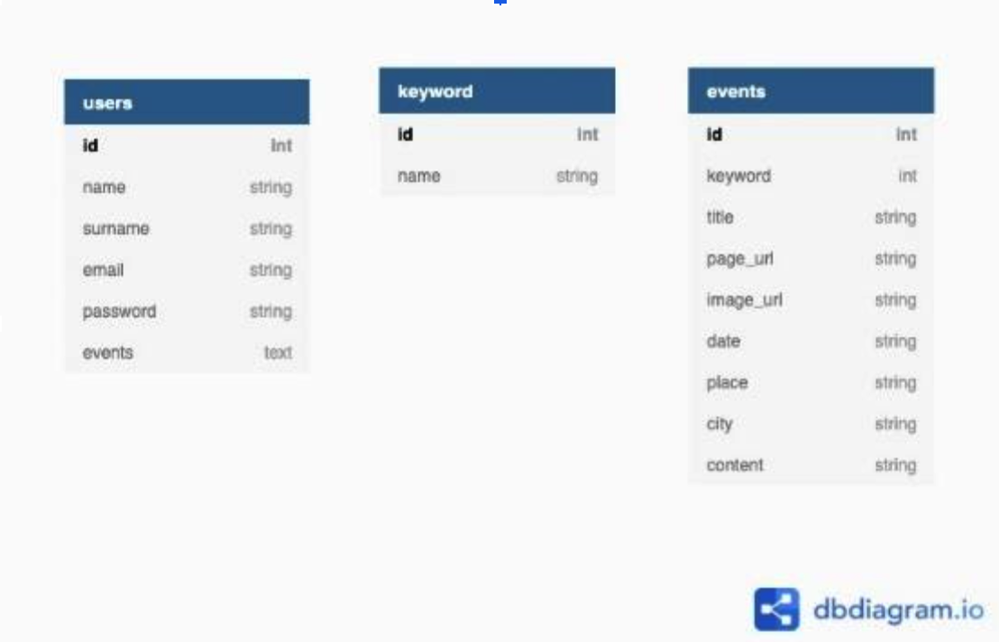

# Etkinlik Takip Uygulaması

Kullanıcılar bu uygulamayı kullanarak takip ettiği sanatçıları ve hoşlandığı etkinlik türlerini (tiyatro, stand-up, basketbol maçı vb.) arayarak bulabilir.

Kullanıcı uygulama üzerinden arama yaptıktan sonra web scraping yöntemi ile arama sonucuna uygun bilgiler elde edilir. Kullanıcı arama yaptığı anahtar kelimeyi favorilerine eklerse ilerleyen zamanlarda benzer etkinlikler mobil uygulama ekranında listelenir.

Hazırladığım proje 4 yapıdan oluşuyor. Bunlar;

-   mobil uygulama geliştirme,
-   backend API oluşturma,
-   veritabanı hazırlama
-   scraping api geliştirme.

Bu yapılar arası iletişim aşağıdaki şekilde belirtildiği gibi olmaktadır.

 
     
    
Yazılım Mimarisi

## Mobil Uygulama Geliştirme Süreci

Bir mobil uygulama projesi geliştirdiğim için ya native ya da hibrit uygulama geliştirilen ortamlardan birini tercih etmem gerekiyordu. Java veya Kotlin kullanıp sadece android bir uygulama geliştirebilirim veya Swift kullanarak sadece IOS uygulama geliştirebilirim. Bunlar için ayrı ayrı öğrenme sürecinden geçmem gerekiyordu. Ancak ben hibrit bir ortam kullanıp her iki işletim sistemi için uygulama geliştirmeye karar verdim. Bu sebeple javascript bilgim de olduğundan react native framework kullanmaya karar verdim.

### React Native Framework Avantajları

-   Tek bir dil kullanarak iki farklı işletim sistemi için uygulama geliştirebilme imkanı
-   Javascript dili kullanıldığı için ekstra bir dil öğrenme ihtiyacı olmaması
-   Arayüzü oluştururken HTML-CSS mantığı olduğu için kolay arayüz tasarımı yapılabilmesi
-   Bir ekran üzerindeki değişiklikleri kayıt ettiğinizde aynı anda arayüze yansıması

Aşağıdaki görsellerde tasarladığım sayfaları inceleyebilirsiniz.

 
     
    
Anasayfa

 
     
    
Etkinlik Arama Sayfası

 
     
    
Etkinlik Detay Sayfası

## MongoDB ile Database Oluşturma Süreci

Veritabanı tercihini yaparken önümde iki seçenek vardı. Bunlardan ilki MySQL gibi relational olan bir veritabanı seçmek, ikincisi ise MongoDB gibi noSQL bir veritabanı seçmek. Daha önceki projelerimde MySQL veritabanını çok kullandığım için bu projede kendimi daha çok geliştirmek, yeni bir şeyler öğrenmek ve daha hızlı çalışan bir veritabanı ile çalışmak istediğim için mongoDB kullanmayı tercih ettim.

 
     
    
Etkinlik Detay Sayfası

Bu şemaları daha detaylı açıklamak gerekirse;

-   **Users Şeması:** Kullanıcı bilgileri bu şema üzerinde tutulmaktadır. “name, surname, email, password” alanlarında kullanıcının kişisel bilgileri yer alırken, “events” alanında kullanıcının daha önce arama yaptığı etkinlikler bulunmaktadır.
-   **Keyword Şeması:** Kullanıcıların arama yaptığı anahtar kelimeler sonucunda python scraping API eğer birden fazla etkinlik bulabiliyorsa buraya ilgili anahtar kelimeler kaydedilir.
-   **Events Şeması:** Python Scraping API sonucunda elde edilen etkinlikler bu şema üzerinde saklanmaktadır. Bir kullanıcı etkinlik aradığında ilk önce buraya kaydedilmektedir. Başka bir kullanıcı aynı anahtar kelime ile bir etkinlik aramak istediğinde doğrudan bu şema üzerinden ilgili etkinliğe ulaşabilir. Böylece daha az bekleme süreleri oluşmaktadır.

Veritabanı tercihini yapıp şema tasarımını oluşturduktan sonra mongoDB veritabanını cloud üzerinde barındırmaya karar verdim. Bunun için mongoDB Atlas kullanmayı tercih ettim.
